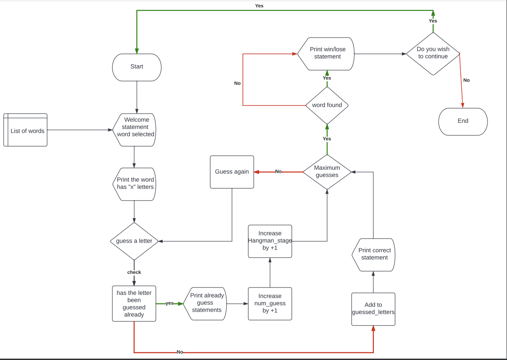

# THE Hangman Game
## Introduction
The game is a simple terminal game implemented in Python. Hangman is a classic word guessing game where the player tries to guess a secret word one letter at a time. The player has a limited number of attempts to guess the word correctly. For each incorrect guess, a part of a hanging stick figure is displayed. The player wins if they guess the word correctly before the stick figure is completely drawn.

The game is targeted at word games lovers to have a simple word game session in python.

[Hangman](https://dashboard.heroku.com/apps/project-3-milestone-hangman)

## Features
* Single-player mode
* Random word selection from a predefined list
* ASCII-based visual representation of hangman and remaining attempts
* Input validation and error handling
* Case-insensitive letter matching

## User Experience
* User stories
    * As a user, I want to be able to 
        *  Naviagte through the game 
        * want to be able input my guesses
        * be able to see the word if not successsful with my guess word
        * see how many attempts i have made
        * Continue to play the game without restarting after each try

## Flow chart
Lucidchart was used to give a logical representation of the game

## Requirements
* Python 3.6 or higher

## How to Play
1. When you start the program, a random word will be chosen form the list of words, you will see the initial game   start with blank spaces representing the letters in the secret word
2. Enter a single letter as your guess. The game is case-insensitive so you can enter either lowercase or uppercase
3. The game will display the result of your guess:
    * if the letter is in the secret word, it will fill in the corresponding blanks
    * if the letter is not in the secret word, a part of the stick will be drawn
4. You will have 6 attempts to keep guessing letters untill you either guess the word correctly or run out of attempts.
5. At the end of the game the palyer will be informed either they won or lost and the secret word.
6. The game will ask if you wish to continue playing with a y/n option:
    * "y" will have the game start with a new secret word
    * "n" will have the game quit saying "Game Over"

## Gaming Experience (Existing features)

* Welcome statements 

* Failed option - player choice letter does not match with any letter in the secret word

* Correct Option - player choice letter matches with one of the letters in the secret word

* You Lose Statement - player has used up all tries and did not succeed in guessing the secret word

* You Win Statement - player has succeded in guesing the secret word

## Technology
* Heroku
* Github
* Lucidchart
* PEP8 

## Testing

