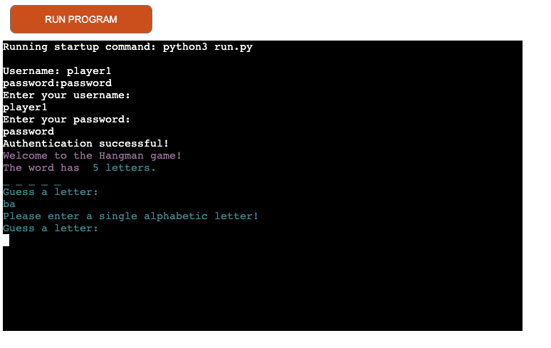
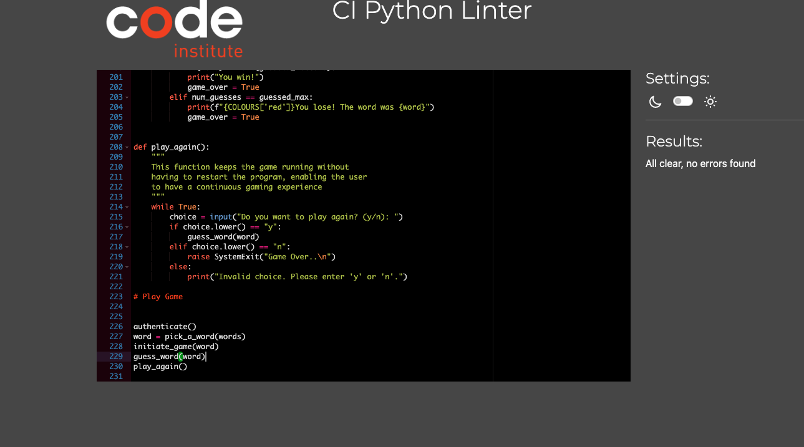

# The Hangman Game
## Introduction
The game is a simple terminal game implemented in Python. Hangman is a classic word guessing game where the player tries to guess a secret word one letter at a time. The player has a limited number of attempts to guess the word correctly. For each incorrect guess, a part of a hanging stick figure is displayed. The player wins if they guess the word correctly before the stick figure is completely drawn.

The game is targeted at word games lovers to have a simple word game session in python.

[Hangman](https://dashboard.heroku.com/apps/project-3-milestone-hangman)

## Features
* Single-player mode
* Random word selection from a predefined list
* ASCII-based visual representation of hangman and remaining attempts
* Input validation and error handling
* Case-insensitive letter matching

## User Experience
* User stories
    * As a user, I want to be able to 
        * get access to the game
        *  Naviagte through the game 
        * want to be able input my guesses
        * be able to see the word if not successsful with my guess word
        * see how many attempts i have made
        * Continue to play the game without restarting after each try
        * have fun

## Flow chart
Lucidchart was used to give a logical representation of the game

## Requirements
* Python 3.6 or higher

## How to Play
1. When you start the program, a random word will be chosen form the list of words, you will see the initial game   start with blank spaces representing the letters in the secret word
2. Enter a single letter as your guess. The game is case-insensitive so you can enter either lowercase or uppercase
3. The game will display the result of your guess:
    * if the letter is in the secret word, it will fill in the corresponding blanks
    * if the letter is not in the secret word, a part of the stick will be drawn
4. You will have 6 attempts to keep guessing letters untill you either guess the word correctly or run out of attempts.
5. At the end of the game the palyer will be informed either they won or lost and the secret word.
6. The game will ask if you wish to continue playing with a y/n option:
    * "y" will have the game start with a new secret word
    * "n" will have the game quit saying "Game Over"

## Gaming Experience (Existing features)

* Welcome statements 

* Failed option - player choice letter does not match with any letter in the secret word

* Correct Option - player choice letter matches with one of the letters in the secret word

* You Lose Statement - player has used up all tries and did not succeed in guessing the secret word

* You Win Statement - player has succeded in guesing the secret word

* Authenticate your details

* Validate user entry is single letter 

## Technology
* Heroku
* Github
* Lucidchart
* PEP8 (Code Institute)

## Testing

CI online Tester (Python Validator) code passed with no errors

### Funtional Tests

ID| Test Label | Test Action | Expected Outcome | Test Outcome
--- | --- | --- | --- | --- |
 1| Welcome to the Hangman Game | Run the game | The player is presented with a welcome message | PASS
2| Guess the word| blank space displayed for input | the player can input data | PASS
3| Failed attempts| player selects a letter not part of the chosen word | the number of attempts count should incrase by 1 | PASS
4| Validate Player details | Player inputs username and Password | the player is granted acces to the game | PASS
4| Validate Player details | Player puts the wrong auth details | print statement to of invalid username or password, tries increment by +1 | PASS
5| guess must be 1 letter | player inputs two letter in one try | print statement of invalid guess | PASS
6| Do you wish to continue y or n | player to continue with out restart | player input y and game restarts without restarting the program | PASS
7| validate that entry is y or n to continue | player inputs a number or wrong letter | print statement of invalid data | PASS
8| player guesses the right word | the player is able to guess the secret word | print statement "you win" | PASS
9| player gueses the wrong word | the player inputs the gues that are wrong | Print statement "upu lose" | PASS
10| player wishes to end loop of continuos play | the player selects "n" when prompted if they wish to continue | print statement "Game Over" | PASS

# Bugs
* There were no bugs discovered during testing

## User stories tested
1. Welcome Statements
2. Authentication of player
3. Access to game
4. Continuous loop of play
5. Navigate through the game

# Deployment
The site was deployed to Heroku. The steps to deploy are as follows:

1. Log in to Heroku
2. Click "Create new app"
3. Choose app name and chose region
4. Click create app
5. Naviagte to the settings tab
6. Click reveal Config Vars
7. Add Config Vars heroku settings. 
8. Add CREDS
8. Add Key "PORT" and Value "800"
9. Scroll Down to Buildpacks
10. Click "Add Buildpack"
11. Add "python" 
12. Add "nodejs" 

# Credits 
* code line 59 - 63 COLORS from mittnamkenny 
* Lucidchart 
* CI Python linter from Code institute
* Am i responsive

# Acknowledgements
Thanks to two mentors that really helped me during this journey Brian Macharia and Mo Shami. Thnak you Mo Shami for your gntle nudge to do more and get my project in the best state. Very thankful.

